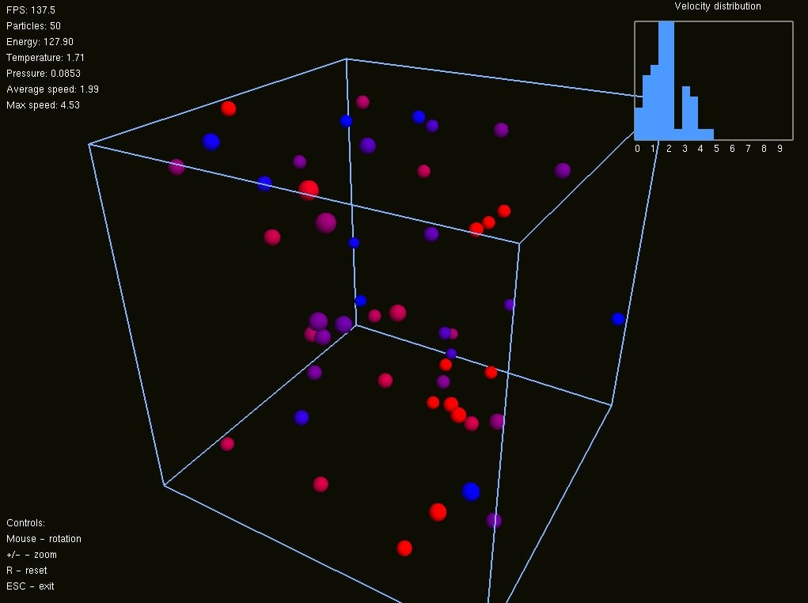
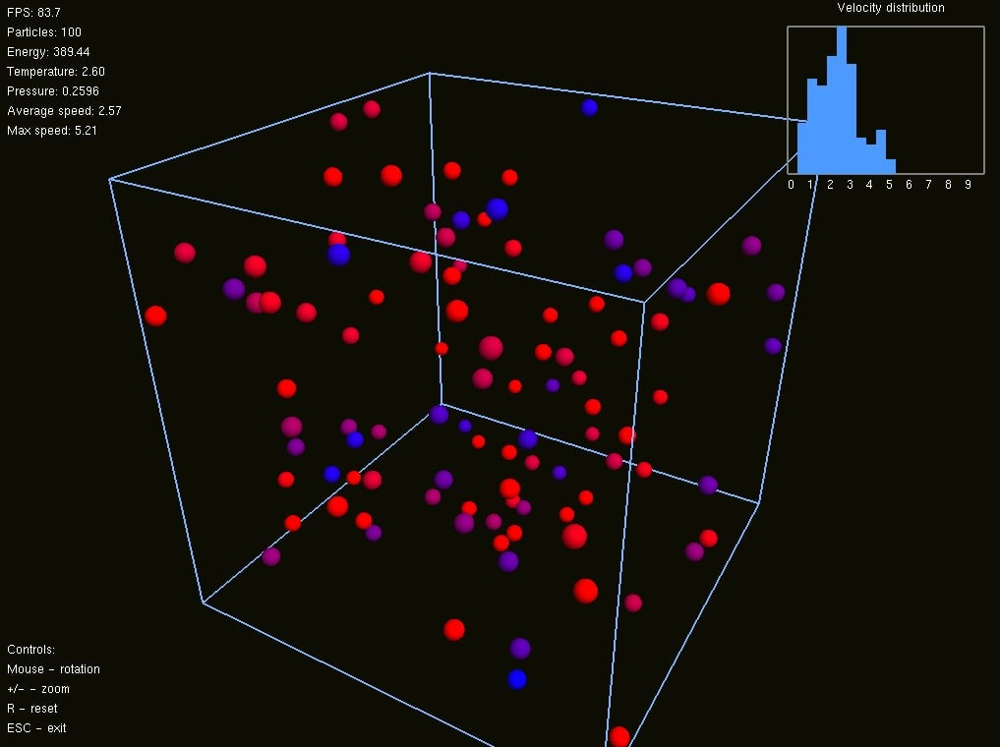
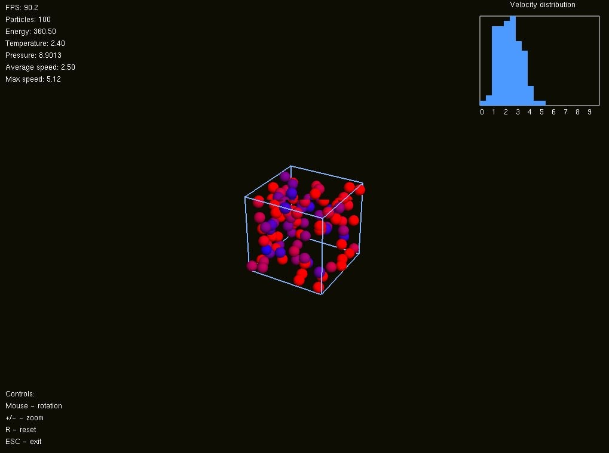

## ideal-gas-simulation
Ideal Gas Simulation is a C++ project that visualizes the behavior of an ideal gas confined within a cubic box. The simulation models particles moving in 3D space, colliding with each other and with the walls of the container. The project is implemented in a modular way, making it easy to extend in the future for studying non-ideal gases or adding additional physics. The system includes particle motion integration, collision handling, wall interactions, and dynamic color updates based on particle velocities, providing a clear visual representation of particle behavior. All components have been fully tested to ensure correct physics simulation and energy conservation.

## Project Structure:
- core/ - Contains the main simulation classes (Particle and PhysicsSystem)
- math/ - Provides vector math utilities (Vector3d)
- render/ - Contains all classes and functions responsible for visualizing the scene and particles, including drawing, camera setup, and OpenGL/GLUT rendering.
- world/ -Holds the simulation logic: particle definitions, physics systems, state updates, and interactions between objects.
- tests/ -Includes unit tests for particle motion, collisions, and color updates

## Installation

1. Install required dependencies (e.g., OpenGL, GLUT).
2. Clone the repository

## Visualizations

### Particle Motion Inside the Container

This figures present a real-time state of the system, 
illustrating particle motion and color mapping based on kinetic energy.
Particles are initialized with random positions and velocities inside the box.

  

  

  

